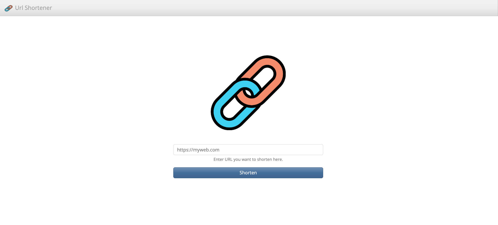

# URL Shortener

## 專案畫面


## 專案介紹
使用 Express 打造的短網址產生器。

### 功能
- 生成短網址
- 複製短網址至剪貼簿

## 開始使用
1. 請先確認有安裝 node.js 與 npm
2. clone 此專案到本地
3. 在本地透過終端機進入資料夾，輸入：

 ``` bash
  npm install
  ```

4. 安裝完成後，輸入：

  ``` bash
  npm run start
  ```

5. 若看見此行訊息則代表順利運行：

  ``` bash
  Server is running on http://localhost:3000
  ```

6. 使用瀏覽器，進入以下網址：

  ```
  http://localhost:3000
  ```

7. 停止使用：

  ``` bash
  ctrl + c
  ```

## 開發工具
- Node 14.16.0
- Express.js 4.18.2
- Express-Handlebars 3.1.0
- Method-Override 3.0.0
- Mongoose 7.0.3
- Bootstrap v5.2.3
- Popper v2.11.6